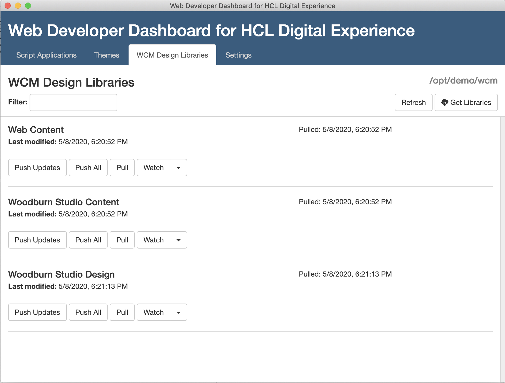

# Web Developer Toolkit for HCL Digital Experience
The Web Developer toolkit provides the ability to sync themes, content and script portlets (also known as script applications). It is available under the Apache License V2.0. 

This toolkit includes four main areas of functionality:
- A "Web Developer Dashboard" that provides a user interface for working with Script Portlets, Portal themes, and WCM design elements. The theme support uses the Digital Experience File Sync tool under the covers. The Script Portlet support uses the Script Portlet command line support which must be installed separately on your workstation.

- A command line tool `dxwcmdesigns` for moving WCM design elements - Presentation Templates and Components - between your local file system and your Portal server. This functionality is also available from the Dashboard.
- A command line tool `dxsync` for synchronizing any WebDAV-based HCL Digital Experience themes with your local workstation. This functionality is also available from the Dashboard.
- A command line tool `sp` to pull & push script portlets.


# Requirements
To use these tools you will need:
- Node.js must be installed on your workstation. Node.js version 12.14 is the minimum version and has had the most testing.

  Note: You can verify that node.js is installed by running the following commands:

    `node -v`

- For the WCM support you need Portal 8.5 with CF05 or later. 

- For the theme support you need Portal 8.5. Under the covers, code from [DX File Sync package](./digexp-dxsync/README.md) is automatically installed when you install this Toolkit.

- For Script Portlet "push" your server must have Script Portlet installed. Under the covers, code from [Script Portlet package](./digexp-sp-cmd/README.md) is automatically installed when you install this Toolkit.

- We have tested successfully on Mac OS X 10.15, Ubuntu 18.0x, Windows 7, and Windows 10. See below for potential issues with the required nw.js library on some operating system versions.

## Known issues and troubleshooting

The Dashboard tool uses the nw.js package to implement the user interface, and on some operating system versions such as CentOS there have been issues with some of the dependency packages for nw.js. We've also had reports of issues on Windows 10. If the install fails during the nw.js installation phase, or if the Dashboard doesn't launch successfully, you can try installing and running example nw.js app (https://www.npmjs.com/package/nw#example) on its own to see if it's a compatibility problem with that library.

For any issues you encounter, please report them in the Issues area of this project (https://github.com/hcl-dx/WebDevToolkitForDx/issues).  We try to respond promptly to reported issues.

# Installation
You must first install Node.js.  Node.js version 12 is the minimum version and has had the most testing.

Download the digexp-toolkit.zip file from here: https://github.com/hcl-dx/WebDevToolkitForDx/tree/master/release

First, extract the file on your workstation. Then goto the extracted folder and run
```
npm install -g
```
The install will take several minutes (mainly due to the install of nw.js), be patient.

This will install the four main programs:

-  `dxdashboard` (for the dashboard UI)
-  `dxwcmdesigns` (the command line support for accessing WCM design libraries).
- `dxsync` (the command line support for accessing WebDAV-based HCL Digital Experience themes)
- `sp` (the command line support for accessing Script Portlets)

In case you are seeing an error like ```Missing write access to /usr/local/lib/node_modules``` you can fix it via the following:
``` sudo chown -R $USER /usr/local/lib/node_modules ```.

If you are behind a proxy server, the nw package used by the Dashboard requires setting the http_proxy environment variable prior to running install. See this page for more information: https://www.npmjs.com/package/nw.

# Upgrade 
If you are upgrading an existing installation you should remove it using uninstall and then install the new version.
See instructions for uninstall below. 

# Uninstall
If you want to uninstall the toolkit, run
```
npm uninstall -g
```

# Using the Web Developer Dashboard
This is a Node.js-based "dashboard" that runs on your laptop and lets you work with your Portal Themes, WCM design libraries, and Script Portlet applications in a simple user interface. 

Key features:
- Select any theme or WCM design library and "pull" all the files into your local file system.
- Click to push applications, theme designs, or WCM design components to a local or remote Portal server.
- Enable and disable "watch" functionality, so that any updates to local files are automatically pushed to the server.
- Work with theme modules and profiles from a simple user interface.
- Run script applications locally on a Node.js-based test server, with dummy rendering of WCM tags.
- Use "splint" (Script Portlet Lint) to check for potential issues with script applications.
- Invoke your own build scripts when pushing Script Portlets to the server, to compile LESS/Sass, combine/minify JS, etc.

## Running the Web Developer Dashboard
To launch the dashboard, run the following command:
```
dxdashboard
```

When you first run the dashboard, you should go to the "Settings" tab to configure your file locations and Portal server settings.
Note that each folder needs to be unique.   
- Script Portlet Folder: The parent folder for your Script Portlet applications. Each Script Portlet is in a child folder, with an index.html as the main file. For example, you can unzip the published Script Portlet samples which are structured this way.
- Themes Folder: The parent folder for your Themes. Each child folder contains all the Webdav artifacts for one theme. To get any theme from the server, click the “Themes” button and select the desired theme.
- WCM Design Folder: The parent folder for WCM design libraries. Each child folder represents one WCM library, with children for Components and Presentation Templates. To get any WCM library from the server, click the “Libraries” button.
- Servers - Name, User, Password, Host, Port, Content Handler, Secure: Set these for your Portal server. You can have multiple server configurations and select the configuration to use. If you are using a Virtual Portal, include the Virtual Portal name as part of the "Content Handler" path, like this: /wps/mycontenthandler/my_vp_name. Set the "Secure" option if the specified port is an HTTPS port.

## Pushing Script Portlet Applications
After setting a folder for Script Portlet applications in the settings tab, the
toolkit provides a graphical interfaces for pushing script portlet applications.
Pressing the "push" button will invoke the [`sp` command](https://help.hcltechsw.com/digital-experience/8.5/script-portlet/cmd_line_push_cmd.html) and push the 
application to the active server specified in the settings. If an `sp-config.json`
file exists, it will be used when pushing the application. Pressing the gear button
will open a dialog for editing the application's `sp-config.json` file.

In the same dialog box (at the bottom), there is an option to set a pre-push command
which can be used for minifying javascript, transpiling coffeescript, SASS, etc., 
running a gulp or grunt build process, or launching other tools. This command will
be run from the application's directory and will be run when pressing the push button
or when the application's folder is being watched.

## Testing and Linting Script Portlet Applications
Pressing the run button will runt the script portlet on a test server and open it
in your browser. The test server is a small Express server that includes handling for WCM tags and Ajax Proxy requests:
- Common WCM tags are replaced with mock data. A complete list of tags that replaced
  with mock data can be found [here](https://github.com/hcl-dx/WebDevToolkitForDx/blob/master/digexp-sp-server/tag-replacements.json)
- AJAX requests that use Portal's Ajax proxy will be sent through a local proxy.
  The test server supports the ResourceURL tag and URLs that use "/wps/proxy/"
- Other tags are removed and won't appear in the html.

Pressing the "SP Lint" button will run a linting utility for Script Portlet that
will analyze the script portlet application and detect possible issues in the 
code where it is recommended to follow best practices.

## Working with themes in the Dashboard
To work with theme files locally, first click "Get Themes" followed by "View Server Themes," then you will see a list of themes on the server. For any themes you want to access, enter the name to use for the local file folder and click "Create Theme Folders." Then to download the theme files, click the "Pull" button for the theme. Once you have pulled files for a theme, the "Pull" button will download only the files that have been changed on the server. To update the server with your local changes, click "Push Updates." You can also enable "Watch" to cause a push of updated files whenever change is made in your local folder.

## Working with WCM design files in the Dashboard
To work with WCM design files locally, first click "Get Libraries" followed by "View Libraries." Then select the library or libraries you want to work with and click "Download Selected Libraries." To update the server with new or modified files, click "Push Updates" or "Push All." The "Pull" button will download all files. The "Watch" button will watch for changes to files in the local folder and push those changes automatically. Note that the "Push" commands won't delete any components on the server; for that you would need to use the WCM Authoring tools.

# Limitations

1. Start and Stop the watcher on same function/tab.
2. Script Portlet export option is not available on dxdashboard, it is only enabled in cli now.
3. Script Portlet command line tool available to download via DX is an old deprecatted version. For the latest use the one in this toolkit.

## Support

In case of questions or issues please raise via Issues tab in this github repository. HCL Support will make every reasonable effort to assist in problem resolution of any issues found in this software.
